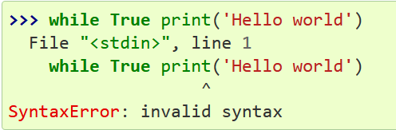

### Nama : Herlan Wibowo
### Kelas : TI 22 A3
### Praktikum-9 Eksepsi (exception) Pada Python
#### Pengertian Eksepsi

Eksepsi (exception) merupakan suatu kesalahan (error) yang terjadi saat proses eksekusi program sedang berjalan, kesalahan ini akan menyebabkan program berakhir dengan tidak normal. Kesalahan-kesalahan ini dapat diidentifikasikan dengan nama tertentu dan direpresentasikan sebagai objek di dalam python.
#### Kesalahan Sintaksis

Kesalahan sintaksis atau kesalahan menulis baris kode biasanya menampilkan tanda panah pada awal terdeteksinya kesalahan.

#### Contoh Eksepsi

Bahkan jika suatu pernyataan atau ungkapan secara sintaksis benar, itu dapat menyebabkan kesalahan ketika suatu usaha dilakukan untuk mengeksekusinya. Kesalahan yang terdeteksi selama eksekusi disebut exceptions dan tidak fatal tanpa syarat. Namun, sebagian besar pengecualian tidak ditangani oleh program, dan menghasilkan pesan kesalahan seperti yang ditunjukkan di sini:

Baris terakhir dari pesan kesalahan menunjukkan apa yang terjadi. Pada contoh diatas menunjukan bahwa tipe data yang berbeda tidak bisa dijumlah.
#### Membangkitkan eksepsi dengan raise

Satu-satunya argumen untuk raise menunjukkan pengecualian yang dimunculkan. Ini harus berupa instance pengecualian atau kelas pengecualian (kelas yang berasal dari Exception). Jika kelas pengecualian dikirimkan, itu akan secara implisit diinstansiasi dengan memanggil pembangunnya constructor tanpa argumen:

#### Menggunakan Blok try ...except

Dimungkinkan untuk menulis program yang menangani pengecualian yang dipilih. Lihatlah contoh berikut, yang meminta masukan dari pengguna sampai integer yang valid telah dimasukkan, tetapi memungkinkan pengguna untuk menghentikan program (menggunakan Control-C atau apa pun yang didukung sistem operasi)

Pernyataan try berfungsi sebagai berikut.

    Pertama, try clause (pernyataan(-pernyataan) di antara kata kunci try dan except) dieksekusi.
    Jika tidak ada pengecualian terjadi, except clause dilewati dan eksekusi pernyataan :keyword: try selesai.
    Jika pengecualian terjadi selama eksekusi klausa try, sisa klausa dilewati. Kemudian jika jenisnya cocok dengan pengecualian yang dinamai dengan kata kunci exception, klausa except dioperasikan, dan kemudian eksekusi berlanjut setelah pernyataan try.
    Jika terjadi pengecualian yang tidak cocok dengan pengecualian yang disebutkan dalam klausa kecuali, itu diteruskan ke luar pernyataan try; jika tidak ada penangan yang ditemukan, ini adalah unhandled exception dan eksekusi berhenti dengan pesan seperti yang ditunjukkan di atas.
#### Fitur Eksepsi Pada Python

Python menyediakan dua fitur yang sangat penting untuk menangani kesalahan tak terduga dalam program Python Anda dan menambahkan kemampuan debugging di dalamnya.

Exception Handling
Assertions Exception adalah sebuah peristiwa, yang terjadi selama pelaksanaan program yang mengganggu aliran normal instruksi program. Secara umum, ketika skrip Python menemukan situasi yang tidak dapat diatasi, hal itu menimbulkan pengecualian. Exception adalah objek Python yang mewakili kesalahan.
#### File Handling

Python memiliki beberapa fungsi untuk membuat,membaca,membuka dan menghapus file

fungsi file open() mengambil dua parameter: nama file,mode
Ada 4 metode untuk melakukan file handling pada python:
"r" (read) membuka file untuk membaca,error jika file tidak ada
"a" (add) membuka file untuk ditambahkan,membuat file jika tidak ada
"w" (write) membuka file untuk ditulis,membuat file jika tidak ada
"x" (create) membuat file yang ditentukan ,mengembalikan kesalahan jika file itu ada
#### File Open

Sintaks:

f = open("file.txt")

atau :

f = open("file.txt","rt")
#### File Read

f = open("demofile.txt","r")

print(f.read())
#### File Write

f = open("demofile.txt","a")

f.write("Hello this is first line message")
f.write("Hello this is 2nd line message")
